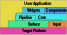

# CUI - A Component-Based C++ UI Library

*This repository represents the code of my master's thesis in Informatics at the Technical University of Munich*

My topic was the development of a UI system for E-Paper displays driven by an embedded device.

This resulted in a C++ UI library that is:

* **:package: Component-based** reuse of UI elements and adaption to different platforms to make the best use of the platform's capabilities
* **:cyclone: Dynamic** presentation and updating of content without requiring an ESP32 firmware update

Further the CUI C++ UI library achives:

- Deterministic execution of the UI on many device families through WebAssembly compilation.
- Our UI does not require any dynamic memory allocation and can be placed entirely in static memory.
- Due to a clear separation of the display and the UI we can target platforms with the least capabilities (E-Paper displays) and maximal capabilities (GPU) efficiently at the same time.
- The WebAssembly compilation target reduces the code iteration time by updating the UI on an ESP32 via WASM over the network.

---

CUI features a highly decoupled architecture of five layers:



Therefore CUI can run on many devices, for instance a ESP32 micrcontroller.


A UI can be created through structural composition:

```cpp

class Weather final : public Container {
public:
  using Container::Container;
  using Container::operator=;

  struct Info {
    std::string_view city;
    std::string_view weather;
    BitMapImage image;
    Paint imbue;
    Clock::Duration time;
  };

  void setInfo(Info const& info) {
    city_.setText(info.city);
    weather_.setText(info.weather);
    image_.setImage(info.image, info.imbue);
    clock_.setTime(info.time);
  }

protected:
  void onLayoutBegin(Context& context) noexcept override {
    Container::onLayoutBegin(context);

    // Prefer vertical alignment when the constraints are wider than higher
    if (constraints().y > constraints().x) {
      align_.setOrientation(AlignOrientation::Vertical);
    } else {
      align_.setOrientation(AlignOrientation::Horizontal);
    }
  }

private:
  AlignContainer align_{*this, Alignment{AlignOrientation::Horizontal,
                                         AlignDirection::Reverse}};

  PaddingContainer padding_{align_, 4};
  AlignContainer text_align_{padding_, Alignment{AlignOrientation::Vertical}};

  TextView weather_{text_align_};
  TextView city_{text_align_};

  BitMap image_{align_};

  PaddingContainer clock_padding_{align_, 4};
  AnimatedClock clock_{clock_padding_};
};
```

Or functional compositing:

```cpp
inline auto SomeElement() {
  return Center(Center(BitMap(emoji, emoji_paint), Padding(TextView("Huhu")),
                       AnimatedClock()),
                TextView("This is some element"), MyWidget{});
}
```


---

<details>
  <summary>Gallery</summary>
Rendering on a desktop dev tools application:

https://user-images.githubusercontent.com/1146834/125159629-e4730380-e178-11eb-8d0b-c21c24bde896.mp4

The usage of an automatic layout system

https://user-images.githubusercontent.com/1146834/125159988-f2c21f00-e17a-11eb-8ab0-e6843b7a0daa.mp4

Partial and windowed updates

https://user-images.githubusercontent.com/1146834/125159992-f48be280-e17a-11eb-91a7-17e266b20fcc.mp4
</details>
